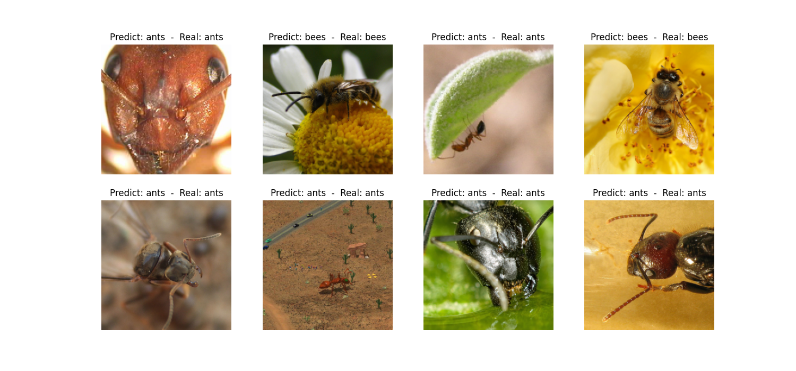

# Ants and Bees Classifier using Transfer Learning of ResNet18

This project implements a deep learning model to classify images of ants and bees using transfer learning of ResNet18 in PyTorch on Jupyter.

## Overview:
The dataset used is the ANTS & BEES dataset from Kaggle. The dataset contains 244 images of ants and bees, split into training and validation sets.


Transfer learning of ResNet18 is used to train the model. The pre-trained weights of ResNet18 are loaded, and only the fully connected layer is replaced with a new layer with two output units (one for each class). The network is then fine-tuned by training only the new layer while keeping the rest of the network frozen. This allows us to leverage the knowledge learned by the ResNet18 network on a large image dataset (ImageNet) and apply it to our specific task.


The implementation is done in PyTorch on Jupyter. The code is divided into several parts, including data loading, model definition, training and evaluation, and visualization.

Requirements:
```
PyTorch 1.9 or higher
Torchvision 0.10 or higher
Jupyter Notebook
```

## Usage
Install the required dependencies:
'''
pip install torch torchvision jupyter
'''
Download the ANTS & BEES dataset and extract it to a folder named data.

Open ants_and_bees_classifier.ipynb in Jupyter Notebook.

Run the cells one by one to see how the model is defined, trained and evaluated.

Modify the code as needed to experiment with different hyperparameters, network architectures, etc.

## Results
The model achieves an accuracy of around 95% on the validation set after training for 25 epochs. The loss and accuracy curves are plotted for visualization.

you can see 8 output below:


Acknowledgments
Dataset: ANTS & BEES by Ajay Rana
Pre-trained model: ResNet18 in PyTorch torchvision.models module
